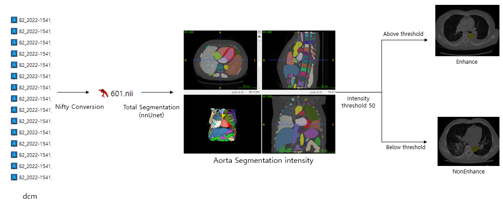

# Syntax_missing_SW
 
**DEVELOPED BY**: MI2RL (울산대학교)

## Abstract

- The nnUNet model was used to segment the aorta (aortic region).

- The segmented aorta area was analyzed based on its area and pixel intensity values to determine whether it is in an enhanced or non-enhanced state.

- Additional information, such as axial, sagittal, and coronal views, was extracted from the DICOM header.

- The extracted DICOM tag information was compared with a pre-existing reference dataset to evaluate the accuracy of the analysis results.

## Description

## Usage Notes

### Requirements

- pytorch (latest version)
- matplotlib 3.3.4
- SimpleITK 1.2.4

### Inference

`%cd nnUNet_v2_inference_lowres
!python DataExtraction_CSV_subprocess.py -input_dcm '../dcm_input' -gpu_num 1`

- `-input_dcm`: Input folder location of CXR images.
- `-gpu_num`: Enter the GPU number to be used.

The result is It is created as an output.csv file in nnUNet_v2_inference_lowres..

### Download nnUNet Weights

The nnUNet model weights are not included in this repository.  
You can download the pre-trained weights from the following link:

👉 [Download nnUNet Weights](https://drive.google.com/drive/folders/1EUe4gE6GwGCh5hS5ZkWoHO_nLW_nGVYS?usp=sharing)

After downloading the weights, place them in the following directory:
Syntax_missing_SW/nnUNet_v2_inference_lowres/nnUNet_results/Dataset001_total_segmentor/nnUNetTrainer__nnUNetPlans__3d_lowres

## Summary

The nnUNet model was used for aortic segmentation and analysis, incorporating pixel intensity, multi-view DICOM data, and reference dataset comparison.
## Tag(Input)

DICOM

## Tag(Purpose)

Segmentation, Evaluation

## Reference

The nnUNet model was trained using in-house data from Asan Medical Center (AMC), which includes a large set of curated medical images for aorta segmentation.

## Files
⬇️ [Download SW](https://github.com/mi2rl/DataCuration/tree/386eafa30667b9558f4d24ee702955b75d36a4fd/Syntax_missing_SW)

## Contributing

If you'd like to contribute, or have any suggestions for these guidelines, you can contact us at junegoo.lee@gmail.com or open an issue on this GitHub repository.
